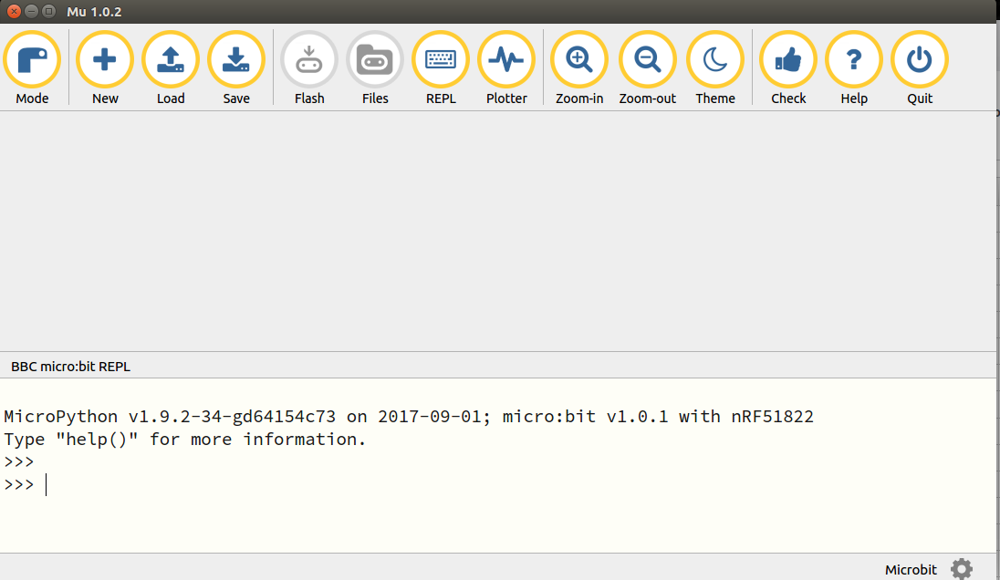

# Preparations before Coding

If you want to use Micro:bit to control the MU Vision Sensor, you need to import the MicroPython firmware that contains the ‘MuVisionSensor’ module. 
Please follow the steps below:

(1) Download the firmware:

GitHub: <https://github.com/mu-opensource/MuVisionSensor3-MicroPython>

Official Website: <http://mai.Tosee.com/page.php?a=sensor-support>

(2) Flash the firmware: 

Connect the micro:bit to computer via USB cable,and drag the downloaded frimware “microbit-micropython-MuVisionSensor-0.8.0.hex” to MICROBIT disk.
Micro:bit will flash the new firmware and restart.

(3) Download and install Mu Editor: 

Mu Editor is a simple Python code editor for beginner programmers with friendly GUI.

It can be downloaded in the main page: <https://codewith.mu/>

(4) Import module

Open Mu Editor, change the mode to BBC micro:bit,and click the”REPL”button to enter serial reply mode.The micro:bit will send firmware version at first.
Type the code below and press enter to run

```python
>>> from MuVisionSensor import *
```

Now you can call all the public APIs in ‘MuVisionSensor’

*Key words auto-completion fuction is only available in REPL mode.*



# Connect to Micro:bit

MU Vision Sensor 3 periphrals and ports:


I2C Mode

(1)Output Mode DIP Switch: set switch 1 downwards and switch 2 upwards

(2)Connect the output Pin1(SDA) to the Pin20 of Micro:bit, and Pin2(SCL) to Pin19  of Micro:bit. Also connecting the ground pin and 3.3v power pin to micro:bit.

(3)Change the I2C address of MU Vision Sensor by resetting Address DIP Switch. In default both switches are downward and the address is 0x60.
(Changing this setting is not recommended)

*Only I2C mode is supported now.*

You may need a shield to connect MU to Micro:bit, as is shown below:


# Usage of APIs

## Initialize MU Vision Sensor

Two steps to initialize this sensor:

Step1. Call the ‘MuVisionSensor(‘address’)’ to create an object , the value of ’address’  should be consistent with the setting of Address DIP Switch 
(default is 0x60); 

Step2. Call the ‘begin()’  function to start this sensor;

## Enable Algorithms

**API**

```python
MuVisionSensor.VisionBegin(vision_type)
```

All available ‘vision_type’s as follows:

`VISION_COLOR_DETECT`

`VISION_COLOR_RECOGNITION`

`VISION_BALL_DETECT`

`VISION_BODY_DETECT`

`VISION_SHAPE_CARD_DETECT`

`VISION_TRAFFIC_CARD_DETECT`

`VISION_NUM_CARD_DETECT`

`VISION_ALL`

**Example**

```python
from MuVisionSensor import *  #import the library
.... #
mu.VisionBegin(VISION_COLOR_DETECT)  #
mu.VisionBegin(VISION_SHAPE_CARD_DETECT | VISION_BALL_DETECT) #enable card detect and ball detect algorithms
```

## Set Performance Level

**API**

```
MuVisionSensor.VisionSetLevel(vision_type, level)
```

‘level’ can be set to:

`LevelDefault`

`LevelSpeed`

`LevelBalance`

`LevelAccuracy`

**Example**

```
mu.VisionSetLevel(VISION_BALL_DETECT, LevelSpeed)
```

### Get Performance Level

**API**

```
mu.VisionSetLevel(vision_type)
```

The return value is between 0~3, which represents the 4 levels

## Enable High FPS Mode

**API**

```
MuVisionSensor.CameraSetFPS(mode)
```

'mode' can be set to:

`FPSNormal`

`FPSHigh`

### Get FPS Mode

**API**

```
MuVisionSensor.CameraGetFPS()
```

return ‘0’(FPSNormal) or ‘1’(FPSHigh)

## Set White Balance Mode

Adjust the color cast caused by the changes of external light sources.

**API**

```
MuVisionSensor.CameraSetAwb(mode)
```

‘mode’ can be set to:

`AutoWhiteBalance`

`LockWhiteBalance`

`WhiteLight`

`YellowLight`

### Get White Balance mode

**API**

```
MuVisionSensor.CameraGetAwb()
```

The return value is between 0~3,which represents the 4 WB modes.

## Set Digital Zoom Ratio

**API:**

```
MuVisionSensor.CameraSetZoom(mode)
```

‘mode’ can be set to:

`ZoomDefault`

`Zoom1`

`Zoom2`

`Zoom3`

`Zoom4`

`Zoom5`

### Get Digital Zoom Ratio Setting

**API**

```
MuVisionSensor.CameraGetZoom()
```

The return value is between 0~5, which represents the 6 zoom levels.

## LED Settings

**API**

```
MuVisionSensor.LedSetColor(led, detected_color, undetected_color, level)
```

Explanations of these parameters:

led: the LED you want to configure, the available values

`Led1` 

`Led2`

detected_color: colors which are detected, the available values as follows

`LedClose`

`LedRed`

`LedGreen`

`LedYellow`

`LedBlue`

`LedPurple`

`LedCyan`

`LedWhite`

undetected_color: colors  which are not detected, same available values as detected_color.

level: set the brightness level; an integer between 0 and 15; the larger the brighter.

## Restore Default Settings

**API**
```
MuVisionSensor.SensorSetDefault()
```

## Restart

**API**
```
MuVisionSensor.SensorSetRestart()
```

## Get Results of Detection

**API**
```
MuVisionSensor.GetValue(vision_type, object_inf)
```

The available values of  ‘vision_type’ are as mentioned above.

object_inf can be set to: 

`Status` 0 means undetected, 1 means detected

`XValue`

`YValue`

`WidthValue`

`HeightValue`

`Label`

`RValue`

`GValue`

`BValue`
